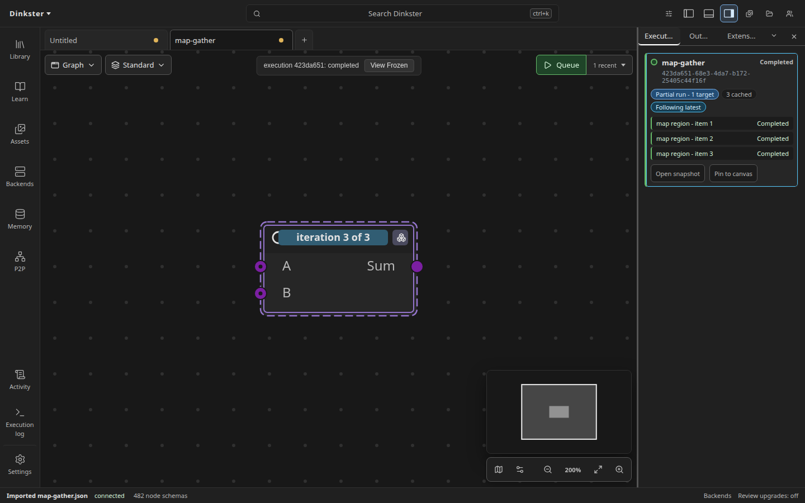

# ComfyUI Workflow Translation

Dinkster translates maintained ComfyUI classes through `dinkster-comfy-alias/1`
registries delivered by installed native packs. Each record identifies one
ComfyUI source class and snapshot, its native carrier, a declarative
replacement rule, and either op-level or family-level confidence evidence.
Core records are pinned to ComfyUI revision
`b5cc8830279eae909a59de030af1e50761c36751`.

Record IDs use the dedicated `comfy_alias:<pack>/<class>` namespace. Their
source snapshots retain compatibility types such as `comfy.ImageScale`, but
exist only while importing and planning a replacement: they are not normal
schemas, executable nodes, or palette entries. Searching by an old ComfyUI
class name instead finds the native carrier. If installed packs claim the same
bare class name, the importer leaves it unresolved and reports the collision
rather than guessing.

Import first decodes each maintained source against its immutable snapshot,
then runs its replacement rule. A clean mapping applies atomically and remains
undoable. If any maintained alias in an imported workflow needs review, none
of that workflow's maintained aliases auto-apply. The source nodes and their
data stay available for explicit review instead of applying a partial
translation.

Positional and keyed static COMBO widgets normalize a finite numeric literal
to its canonical string only when that exact string is a declared option.
An exact numeric option in a legacy schema takes precedence. A legacy string
that exactly matches one unique structured option label is stored as that
option's canonical value; an already canonical value still takes precedence.
Ambiguous labels, padded spellings, and unmatched values are not coerced, so
invalid choices remain available for normal validation. Normalized values
survive native save/reopen. Legacy tuple display labels remain unchanged.

ComfyUI `Note` and `MarkdownNote` records translate directly to Dinkster's
frontend-only Note and Markdown Note kinds. Text, title, position, size, and
color remain visible and editable after import. The core LiteGraph translation
API emits corresponding note records for export callers; native app downloads
remain Dinkster workflow documents. Notes never enter the executable graph sent
to a backend. Reroutes remain document constructs and use the topology
translator.

Replacement rules can map ordinary inputs and outputs, copy one top-level
Autogrow family to a differently named target family, or address an
explicit ordered set of target-family members from fixed source inputs.
Family copy preserves authored suffixes, order, values, controllers, links,
and named-net sinks. Import reconstructs members from every authored input
slot, including unlinked slots, before decoding positional or keyed widgets.
Nested dynamic family templates are rejected for review rather than inferred.

Version migrations can select cases from stored nested DynamicCombo choices.
Rules may also materialize top-level input families on helper nodes and link
helper outputs to those explicit members. Standalone input mappings cannot
override members owned by a family mapping.

ComfyUI-KJNodes `SetNode`/`GetNode` pairs and cg-use-everywhere resolved
connections import as native named nets and compile to the same executable
topology as explicit links. These Set/Get node types come from
ComfyUI-KJNodes; rgthree-comfy and ComfyUI-Custom-Scripts do not define them.
The importer requires the KJNodes single-input/single-output Set shape,
single-output Get shape, one unambiguous named Set source, valid slot-zero
wiring, and consistent serialized types. Missing sources or matches,
duplicates, malformed shapes, conflicting types, and cycles fail the whole
import with diagnostics. KJNodes names resolve inside each definition before
any subgraph inlining, so identically named nets in separate graphs never merge.

## LiteGraph subgraphs

Import indexes flat and recursively nested `definitions.subgraphs` catalogs,
then translates child definitions before their parents. UUID boundary identities,
instance references, positions, promoted values, and fan-out inputs survive.
Schema-v1 object links and v0.4 tuple links are accepted. Competing definition
links follow LiteGraph's load rule: prefer the inner input's serialized `link`,
otherwise retain the first delivery in document order.

Modern instance widget arrays follow promoted-input order without implicit
seed-controller entries. Legacy `proxyWidgets` references promote matching
inner widgets; missing host values inherit the definition's saved values.
Unresolved widget state stays under `importer.subgraphWidgets` with a warning.

A definition whose boundary cannot be derived by Dinkster is inlined per
occurrence with `import.subgraphs.inlined`. This includes structural producers,
unsupported dynamic boundaries, and missing inner schemas. Connections, values,
controllers, and nested supported instances remain independent per occurrence.
The original definition catalog and removed instance state remain under importer
extension fields for review. Cycles and malformed definitions refuse the import;
inlining never invents a backend node alias. The boundary-forwarding cases in
[issue #397](https://github.com/Kosinkadink/Dinkster-Frontend/issues/397) remain separate.

The format reference is Comfy-Org/ComfyUI_frontend revision
`96f4a09a570d1bca4cd10c8407ed8e5c20a23875`. Browser coverage imports three
official nested workflows, drills through both boundaries, and saves/reopens
native documents. Fixture provenance is in
`packages/core/fixtures/workflows/official-subgraphs/README.md`.

## Generic Loops

Maintained ComfyUI `StartLoop` and `EndLoop` pairs import as explicit fold
regions. Simple, For, and List iteration preserve binding order, carried state,
first and last flags, accumulated scalar or output-list results, final-only
results, termination targets, nesting, and iteration cache policy. A loop with
no carried state remains a fold because ComfyUI executes iterations in order.
Compatible lazy switches lower to Dinkster's native selector inside the region,
so each iteration executes only its selected branch.

The importer pairs boundaries from the authored topology and refuses the whole
import when pairing is ambiguous or malformed, a body escapes its End Loop, a
carry cannot keep one stable type, output cardinality is unknown, or topology
sugar prevents an exact rewrite. Linked `accumulate` controls are also refused:
Dinkster output roles are static, while changing `accumulate` at execution time
would change the output contract. Linked Simple or For range controls feed a
generated integer-range node, so upstream batch sizes and computed bounds remain
live inputs. Static `accumulate=false` uses a `last` output, which yields typed
absence for zero iterations. `cache_iterations=true` maps to `reuse`; false or
omitted maps to `rerun`.

Loop bodies containing a schema flagged `mayExpandGraph` refuse with
`import.loop.runtimeExpansionUnsupported`; derived subgraph schemas propagate
the flag from their descendants. Nested Start/End boundaries are consumed
before the enclosing body is checked. V3 flags exactly
`enable_expand=True`. V1 flags direct dict-literal expansion returns and the
enumerated core expanders at the pinned revision. Delegated, dynamic, and custom
V1 returns remain unclassified and rely on Dinkster's loud runtime refusal
before output.

The structural reference and CPU acceptance corpus are pinned to ComfyUI
`b5cc8830279eae909a59de030af1e50761c36751`. The corpus covers 23 openable
workflows, including empty, carried, lazy, output-list, nested, and repeated
cache cases.



### Coverage report

`pnpm coverage:subgraphs` adds a `subgraph-import` status column alongside
the backend report's independent alias readiness. It reads the canonical
Dinkster `docs/comfy-translation-coverage.json`, including `subgraphCount`, without
editing backend aliases or claiming execution support:

```sh
pnpm coverage:subgraphs --templates /path/to/workflow_templates \
  --backend-coverage /path/to/Dinkster/docs/comfy-translation-coverage.json \
  --object-info packages/core/fixtures/object_info.json \
  --json-output coverage/subgraphs.json --markdown-output coverage/subgraphs.md
```

The template checkout must be clean. Both corpus revisions and the schema
source are recorded; backend statuses describe the supplied report's corpus,
not newly added templates. `definitions` means native definitions were retained,
`inlined` means at least one definition needed fallback, `blocked` means no
document was produced, and `not-needed` identifies workflows without subgraphs.
Missing schemas remain unresolved nodes with raw values, not executable aliases.

Against workflow_templates `db9d5859d09c21a2d4101a1c18f64fc2f70e4fa4`, all
247 subgraph-bearing workflows import using the captured source schema catalog.
Import is not a model-inference or backend-alias completeness claim.

## Use Everywhere

Use Everywhere import treats the bounded `extra.ue_links` resolved-edge
manifest as the import authority, then cross-checks it against serialized
state. An input controller must have a broadcast-capable physical input wired
to the declared source. A converted `ue_convert` broadcaster must broadcast
its own named output, retain boolean controller state, and not mark that output
under `ue_properties.output_not_broadcasting`. Serialized source types must
agree with the manifest. Legacy Seed Everywhere must broadcast its own INT
output 0 and becomes an ordinary `PrimitiveInt` source; already-converted
producer nodes remain intact. Marked queue-time links from
`extra.links_added_by_ue` are removed only when their endpoints match the
manifest exactly. Missing, stale, malformed, unavailable, conflicting, or
unsupported state fails the whole import with actionable diagnostics; the
importer does not rerun extension matching.

Focused tests compare compiled prompts for explicit links and translated nets,
and pin deterministic repeated import, native save/reopen identity, document
invariants, and the absence of runtime sugar nodes. Browser coverage imports,
renders, saves, reopens, and submits a mixed direct/Set-Get/Use Everywhere
workflow through the production path.

Problems reports independent totals and confidence-tier counts for imported
op-level and family-level mappings. Family diagnostics also report provider
availability totals and each record's provider status. Malformed registries,
source or record collisions, unsupported family shapes, and unsafe replacement
plans fail closed with diagnostics.

Installed packs can also maintain exact connected-node translations through
`dinkster-comfy-group/1`. A record pins the member source snapshots, node modes,
internal edges, boundary ports, copied parameters, static constants, an anchor,
and a replacement rule. Import matches this data before creating document
nodes. A match collapses to an import-only group schema at the anchor's identity
and position, preserving boundary links, parameter values, and controllers;
the normal replacement planner then produces the native replacement.

Group matching is exact and bounded. Extra or missing internal topology,
undeclared boundary links, mode or constant differences, malformed registry
data, and overlapping matches leave the original nodes unchanged. Import does
not run ComfyUI or custom-node code. Group records contribute their `grouped`
confidence to the same separately reported op-level and family-level totals.

The official TRELLIS.2 Pixal3D workflow imports and compiles through maintained
native aliases for all nine TRELLIS.2 nodes. Its standard CFG, rescale, flow
sampling, loaders, and model-output path remain ordinary shared nodes.
