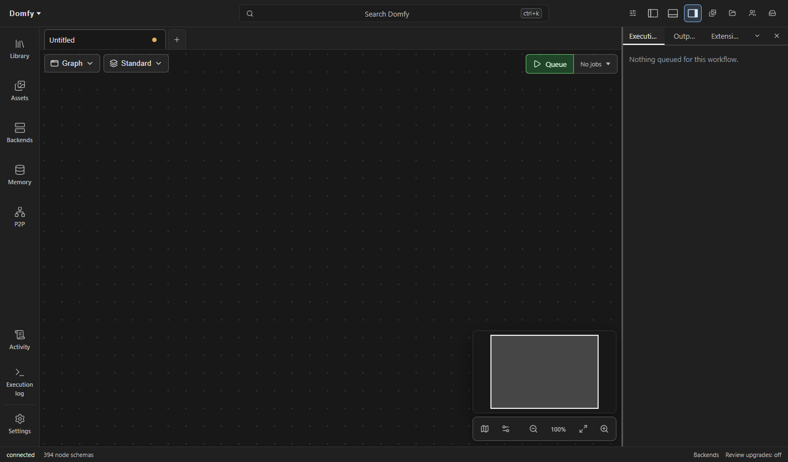
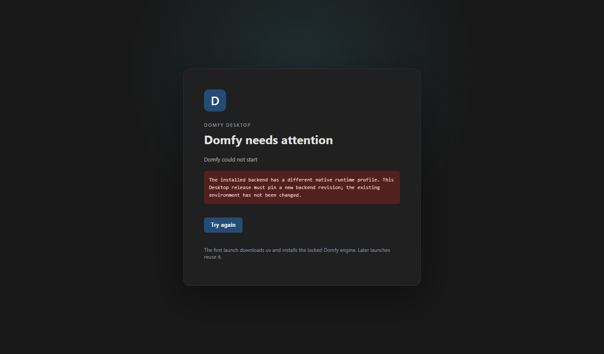
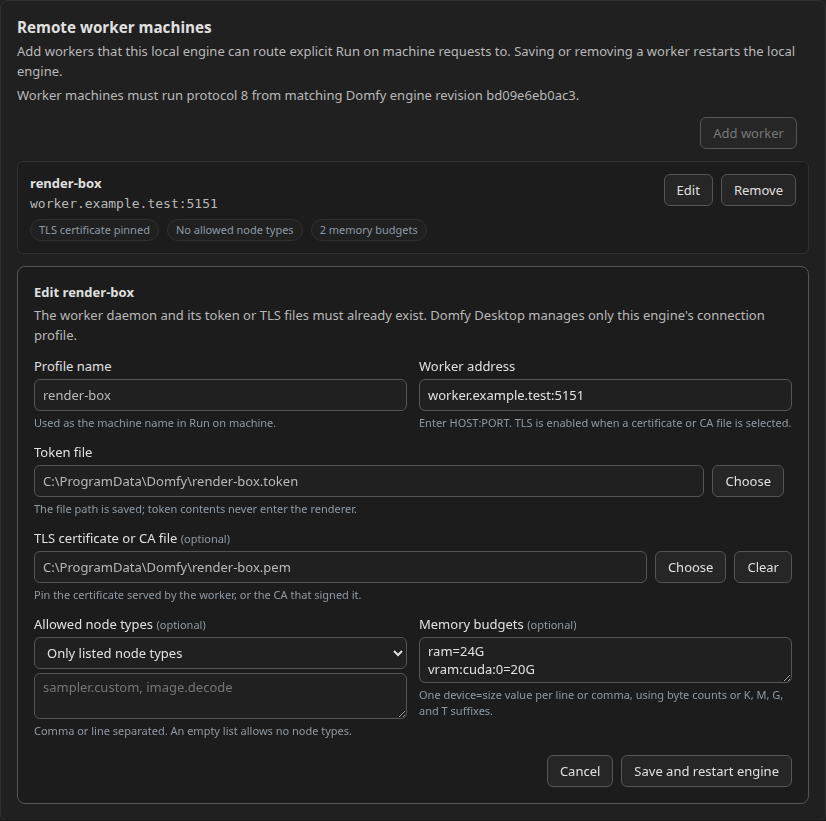
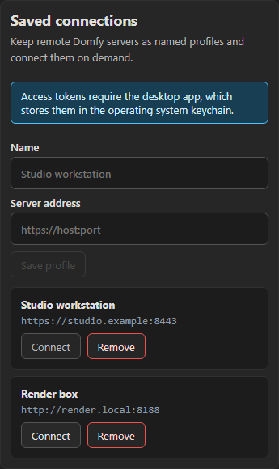

# Dinkster Desktop

Dinkster Desktop is the Windows host for the existing Dinkster application. Its
Electron window uses `contextIsolation`, renderer sandboxing, and no Node.js
integration. Renderer permission requests are denied by default. A narrow
preload reports local-engine setup state; backend and frontend requests stay
on loopback.

## Install and platform support

Releases are private in [Kosinkadink/Dinkster-Frontend](https://github.com/Kosinkadink/Dinkster-Frontend/releases).
Only invited repository readers can download them. There is no public download
site or automatic production update feed.

| Platform | Installation path | Support boundary |
| --- | --- | --- |
| Windows x64 | Download `Dinkster-Desktop-<version>-Setup.exe` and `SHA256SUMS` from the same private release; verify the hash, then run the installer. | Unsigned NSIS Desktop installer. First launch needs internet and several GB of disk space for Python and locked dependencies. Models are installed separately. |
| Linux x64 | [Browser setup](#browser-setup-on-windows-linux-and-macos) with a separately installed backend, or the source launcher below. | No Linux Desktop installer is produced; source setup requires developer tools. |
| macOS | [Browser setup](#browser-setup-on-windows-linux-and-macos) with a separately installed compatible backend. | No macOS Desktop installer or bundled uv platform exists. `start-dinkster.sh` does not support macOS. Backend/model support depends on the backend's documented platform limits. |

Verify the Windows installer in PowerShell with
`Get-FileHash .\Dinkster-Desktop-<version>-Setup.exe -Algorithm SHA256`; compare
the full digest with `SHA256SUMS`. Launch **Dinkster Desktop** after installation.
The first launch prepares a fresh engine environment; subsequent launches reuse
it. A failed setup appears in the app with diagnostic details and a retry action.
First-launch setup chrome follows the persisted application language while
accelerator names, progress details, and errors remain exact host-provided facts.
Do not bypass a checksum mismatch. Uninstall through Windows Installed apps;
the engine library and models are separate from the application binaries.

The installed app opens the workspace after the local engine is ready:



An incompatible native profile stops startup without changing the existing
environment:



On first launch, the app verifies its pinned Dinkster source payload, downloads a
pinned and checksummed uv release, detects the host accelerator as CPU, CUDA,
MPS, ROCm, or XPU, and runs the shared locked `uv sync` with Python 3.12.
The selected value is passed to catalog preparation and the supervisor as
`DINKSTER_ACCELERATOR`; unknown configured or persisted values fall back to CPU
with a desktop diagnostic. On Windows x64, CPU and CUDA selections then install
the checksummed private Aimdo wheel bundled by the maintainer, without an index
lookup or GitHub credentials. Windows CUDA mode also downloads the separately
pinned CUDA Torch wheel, installs it locally, and verifies both the Torch version
and `torch.version.cuda`. These native overrides are not covered by `uv.lock`.
They do not apply to MPS, ROCm, XPU or other operating systems. Accelerator
selection alone does not establish platform or native-library support.
The CUDA wheel requires approximately 1.9 GB of additional download space and is
cached under the engine data directory; it is not bundled in the installer.
Before starting the supervisor, it runs
`dinkster-pack prepare-catalogs --defaults` against the engine's library directory.
Catalog preparation and serving use the same accelerator, native
Python and pinned uv executable. Windows CPU/CUDA pack environments inherit a per-release
constraint file pinning Torch, torchvision and the verified local Aimdo wheel,
with the matching CPU or CUDA Torch index. These constraints apply only to
dependencies a pack requires; they do not disable isolation or alter the initial
locked sync. Every accelerator includes the locked Torch inference package; CPU
selection does not omit workflow execution. Runtime catalog
preparation does not replace the authoring and publication checks in `doctor`.
Later launches of the bundled release reuse the environment and refresh the
default catalogs before serving. Restored older releases retain their existing
environment and catalogs. A catalog preparation failure stops startup rather
than serving an incomplete node inventory.
Supervisor and engine output is retained in the app's Activity. Closing
the main window or choosing Quit stops the complete local process tree.

The Windows NSIS installer is currently unsigned. Windows may show an
unknown-publisher or SmartScreen warning. electron-builder's normal certificate
configuration remains available for signing a later release.

## Multiple windows

Use the arrow-out action on a workflow tab to move that workflow into its own
window. Dragging a tab beyond the strip also tears it out. The child window
keeps the same workflow identity and shared command history, so edits, undo,
redo, and live execution state remain visible in every window. **Move back to
main window** re-docks it.

Open, closed, reordered, and last-active workflow state converges through the
workspace authority before being persisted. A stale window cannot replace that
inventory, and abandoned window sessions expire if a renderer exits without
clean teardown. A write-ahead operation journal preserves changes across a
last-window crash and replays them in causal order after authority reconnect.

Movable panel headers provide **Float** and separate-window actions. Floating
panels can be dragged and resized over the workspace; their placement survives
reload. Native panel windows render only their assigned panel and return to the
panel's prior dock, rail, or bottom placement when re-docked.

Electron persists every workspace window, native workflow windows, native
panel windows, maximized state, and display-relative bounds under the desktop
data directory. Restart restores that arrangement. Bounds from disconnected
displays are moved into a visible work area. The browser-only `.bat` and `.sh`
launchers use the same shared-document authority and support workflow and panel
pop-outs through ordinary browser windows.

Each window is bound to one project (see [projects.md](projects.md)).
Additional workspace windows can open on any project and close independently;
closing the primary window still quits. Workflow and panel windows inherit
the opener's project, and the same workflow can be torn out once per project.

## Managing the desktop installation

Open **Dinkster Desktop** from the app toolbar to inspect local storage, select a
locked CPU, CUDA, MPS, ROCm, or XPU environment, restore an installed engine
release, manage install snapshots and existing model folders, run the system
checker, check for desktop updates, or export a support bundle. Environment
changes stop the local engine first and only become active after the selected
environment starts successfully. A failed change starts the previous selection
again. Each commit and hardware variant has its own release directory, so
preparing a different environment does not overwrite the working one.

The mounted management dialog follows the active English or Chinese locale
without closing forms or changing desktop state. Versions, commits, paths,
worker and node identifiers, hardware and platform facts, update and system
check details, errors, and other host-provided values remain untranslated.

Every environment change writes a durable operation journal before mutation,
captures the current install state, and records the replacement state after a
successful health check. On startup, an interrupted operation restores the
last committed release before clearing the journal. Snapshots record the engine
commit, hardware variant, and installed Python pack and dependency versions.
They can be exported, imported, and restored; restoration refuses an unavailable
release or a dependency set that does not match exactly.

Desktop and browser-only launchers hold the same process lease for the selected
data directory, so they cannot mutate one installation concurrently. Each host
uses a free process-selected loopback backend port and refuses to start when
that port is already owned, before installing dependencies or probing hardware.
Availability is checked again immediately before spawning the supervisor.
Each launch also requires its random instance
identifier in supervisor status responses, so a foreign process cannot satisfy
readiness after the availability check. Supervisor health requests have bounded
deadlines and are cancellation-aware, so shutdown and environment rollback do
not wait on a stalled response.

The model-folder picker grants the local backend read-only access to an existing
directory. The backend indexes models in place; it does not copy them into the
Dinkster library. The local desktop and tinkerer launchers both enable this durable
mount API through their shared engine command line.

### Remote worker machines

The **Remote worker machines** section manages the local engine's existing
`library/remotes.toml` profiles. Each profile names a worker daemon address and
an existing token file, with optional pinned TLS trust, node-type allowlisting,
and per-device memory budgets. Dinkster Desktop validates selected files, patches
the TOML atomically without dropping comments or advanced valid fields, and
restarts the managed local engine after every save or removal. The renderer can
see credential file paths so it can present the form, but it never receives the
files' contents. Each conditional edit retains the claimed pre-edit file as a
unique `remotes.toml.*.backup` and the installed Desktop revision as a unique
`remotes.toml.*.candidate`. This keeps both revisions named even if an editor
writes through an older open descriptor or replaces the live path at any later
point. A conflict is reported when detected. Close manual editors before editing
in Desktop; retained files can be removed after their contents are reconciled.



The worker daemon and its credential files are installed separately. The
packaged engine speaks remote-worker protocol 8; the protocol has no backwards
compatibility negotiation. Install and run `dinkster_workers.service` from matching
Dinkster commit recorded in [the backend release pin](../packages/desktop/src/backend-release.json).
In-flight work survives a
connection loss when the same engine process reconnects to the same daemon
process within the daemon's `--resume-grace` window, which defaults to 120
seconds. Final results and the latest disconnected data-only progress are
delivered; other disconnected progress and preview events may be lost. A daemon
restart, expired grace window, or process identity change fails the invocation
instead of replaying it or choosing another worker. Earlier protocol daemons are
rejected rather than used with incompatible messages. The main process also
refuses configuration mutations while a restored engine has unknown compatibility.

Selecting a TLS certificate or CA file enables verified TLS for that profile;
omitting it uses plain transport. There is no unverified TLS mode. Select all
announced node types to omit the `nodes` allowlist, or select only listed node
types and leave the list empty to allow none. Memory rows use `device=size`,
where size is integer bytes or a value with a K, M, G, or T suffix.

Browser-only and externally managed engines use the same TOML directly under
their library root:

```toml
[worker.render-box]
endpoint = "worker.example.test:5151"
token_file = "/absolute/path/render-box.token"
tls_ca_file = "/absolute/path/render-box.pem" # optional
nodes = ["sampler.custom", "image.decode"] # optional

[worker.render-box.memory]
ram = "24G"
"vram:cuda:0" = "20G"
```

Worker and memory-device names are preserved exactly and must be non-empty and
contain no Python-recognized whitespace or `@`; the worker name also cannot be
`local`. Manual advanced settings such as `trust_reserved` remain in place when
the Desktop form edits that profile.

Installed builds use a generic HTTPS release manifest for on-demand updates.
The production feed is intentionally unwired while Dinkster remains private; the
management dialog reports that state without contacting the placeholder URL in
the packaged manifest. Set `DINKSTER_UPDATE_FEED_URL` to an HTTPS URL, or a
loopback HTTP URL for local testing, to enable checks. The update includes both
the shell and its pinned engine manifest. Downloaded updates are installed only
after the user chooses **Restart and install**. The current unsigned-installer
policy also applies to updates; signing can be added through electron-builder's
standard credentials without changing this flow.

The system checker reports platform, architecture, disk capacity, environment
executables, NVIDIA GPU, driver, and VRAM. The support bundle is a user-selected
JSON file containing those checks plus shell, engine, storage, lifecycle,
snapshot, and recent rotated log details. Engine and shell logs are scrubbed for
authorization headers, cookies, tokens, passwords, secrets, and credential query
parameters before they are retained. No support file is written until the user
chooses a destination.

## Build and release the Windows installer

The single backend pin is `packages/desktop/src/backend-release.json`, copied
from a compatible backend release manifest. Mirror its `desktopWindowsRuntime.aimdo`
and `desktopWindowsRuntime.cudaTorch` objects into the frontend pin's `aimdo` and
`cudaTorch` fields without editing their values. The pin records the immutable
backend main commit, vendored identity commit,
release tags, artifact SHA256 values and remote-worker protocol. Packaging consumes
the exact backend release ZIP rather than independently reconstructing a subset
of source. Never select a moving branch at first launch or put GitHub credentials
in the installer.

After verifying the original ZIP checksum, packaging reads
`dinkster-backend-<commit>/scripts/desktop_windows_runtime.json` from that archive.
Its `aimdo` and `cudaTorch` objects must exactly match the frontend pin structurally;
missing, malformed or differing profiles fail before existing outputs are changed.
There is no fallback for older archives without this source-owned profile.

`cudaTorch` pins the supplemental Windows CPython 3.12 wheel from PyTorch's
`cu130` index, separately from the locked host dependencies. Startup and restart
run the installed executables without resyncing, preserving the native overrides.
Each backend revision and variant has an immutable native profile. Changing the
native pins requires a new backend revision; Desktop rejects a mismatched profile
instead of replacing an existing environment or invalidating its snapshots.
The host CUDA version check is not evidence that isolated pack workers can run
an NVIDIA generation workload; that requires separate integration verification.

On Windows with Node.js 22 and pnpm 10.31.0:

```powershell
pnpm install --frozen-lockfile
$env:DINKSTER_ENGINE_ARCHIVE = 'C:\Downloads\dinkster-backend-<commit>.zip'
$env:DINKSTER_AIMDO_WHEEL = 'C:\Downloads\comfy_aimdo-<version>-cp39-abi3-win_amd64.whl'
pnpm --filter @dinkster/desktop package:win
pnpm --filter @dinkster/desktop verify:update-feed
```

Keep the Windows checkout path short: NSIS cannot read template paths beyond
the Windows path limit. For a deeply nested checkout, install dependencies with
`pnpm install --frozen-lockfile --virtual-store-dir C:\dinkster-build-deps` using a
new directory dedicated to that checkout.

Download the pinned ZIP from the private backend release and the pinned wheel
from the private `Kosinkadink/dinkster-aimdo` release first. The packaging script
rejects missing inputs, size and checksum mismatches before changing outputs,
removes stale engine payloads, and copies only verified artifacts into the
installer. Keep both inputs outside `packages/desktop/resources/engine`;
containment checks resolve filesystem aliases before any output is removed.
Hashing, profile inspection and copying use the canonical input files, so
cleanup cannot invalidate an accepted external artifact through an alias chain.
Outputs are under `packages/desktop/release/`. `verify:update-feed`
checks the generated local manifest, artifact size and SHA512 without enabling
a production update feed.

For installed-app verification, install into a dedicated directory on a test
machine without an existing Dinkster Desktop installation. Set
`DINKSTER_DESKTOP_EXECUTABLE` to that installed `Dinkster Desktop.exe` and
`DINKSTER_DESKTOP_VERIFY_ROOT` to a new, nonexistent directory with a short path
(for example, `C:\Users\<user>\AppData\Local\DinksterTest`), then run
`pnpm --filter @dinkster/desktop verify:installed`. This checks real first-run and
restart readiness with isolated data and Python caches, no Git credentials,
process-selected loopback ports, and screenshots. It defaults to CPU; set
`DINKSTER_ACCELERATOR=cuda` and use another fresh verification root
to exercise the packaged CUDA path. Both runs verify exact native versions and
imports in the host and isolated pack environments; the CUDA run also loads
the Aimdo native library without allocating a model or running inference.
This does not establish macOS or Linux installer support. Deeply nested
data directories can exceed the Windows DLL loader's path limit even when
archive extraction succeeds.

Maintainers release only from `main` using **Private Windows Desktop release**
in Actions. Configure the `DINKSTER_RELEASE_READ_TOKEN` Actions secret in
`Kosinkadink/Dinkster-Frontend` using a dedicated fine-grained token restricted to
`Kosinkadink/Dinkster` and `Kosinkadink/dinkster-aimdo`, with repository **Contents:
read-only** (and GitHub's required read-only metadata access). It needs no write,
administration or organization-wide access. The frontend's automatic
`GITHUB_TOKEN` cannot read those other private repositories. The **Download
pinned private backend and Aimdo** step alone consumes the read token; **Create
private release** uses the workflow's own frontend-repository token instead.
Without the cross-repository secret, the workflow fails immediately after checkout,
before tool setup, tests or downloads. Do not substitute the broad
workspace PAT, put tokens in source or artifacts, or require them at first launch.
Store the read token only in that Actions secret. To rotate it, have the credential
owner create a replacement with the same minimal scope, replace the secret and
revoke the old token after any active acquisition finishes. To remove access,
revoke the token and delete the secret; hosted acquisition then remains blocked.
Local packaging can consume previously downloaded and hash-verified inputs;
that does not bypass release review, exact-main or installed-app verification.
The workflow
rejects forks, non-main refs and public repositories, runs typechecks, tests and browser checks, builds
and installs the Windows package, then checks first launch and restart before
creating `desktop-v<package version>`. Bump `packages/desktop/package.json`
before each release; existing versions are not overwritten. Source and backend
commits, installer size and SHA256 are included in `desktop-release.json`.
The backend release `backend-<pinned commit>` must already exist. Update the pin
only after verifying that backend with the frontend, and merge it before
dispatching. This workflow does not sign binaries or publish a public feed.

### Verify the published private installer without releasing

**Verify published private Desktop 0.2.0** (`verify-published-desktop.yml`) is a
separate, manual, main-only Windows CPU check. It downloads the existing
`desktop-v0.2.0` installer using the frontend's read-only `github.token`, not
the cross-repository PAT. The backend and Aimdo download step alone uses
`DINKSTER_RELEASE_READ_TOKEN`; the first step checks that secret before checkout
or release API access and never falls back. Use the same two-repository,
Contents-read-only scope described above. Dispatch authorization is separate
from preparing this workflow; do not dispatch the release workflow to verify
an existing version.

The committed `packages/desktop/scripts/published-desktop.json` pins the
published installer bytes and original backend revision. A separate checkout
is fixed to the [published frontend source](https://github.com/Kosinkadink/Dinkster-Frontend/commit/d4d3802d4ef196b9278c634c79d15f99d36b3d9b).
Its lockfile, backend/Aimdo pin, native-profile helper, installed harness and
wire parser are used together; later main changes cannot silently replace them.
All three SHA256/size checks and the existing
source-bound native-profile check must pass before installation. The downloaded
unsigned executable is installed in an isolated short runner-temp directory;
acquisition credentials are removed before installation. The existing
`verify:installed` harness uses fresh CPU data/Python/cache roots without Git
credentials and checks first start, restart, native imports and profile refusal.
Cleanup runs even on verification failure, touches only the owned installation,
and removes a protocol registration only when its target exactly matches.

Seven-day private workflow artifacts contain only bounded metadata, cleanup
results and the three successful-case JSON/screenshots, never dependency caches,
browser storage, installer binaries or environment dumps. Inspect the screenshots
before accepting a run. This workflow does not rebuild, sign, publish, overwrite
release assets or test CUDA; local checks do not establish hosted execution.

## Remote connections

The Backends panel keeps **Saved connections**: named profiles holding the
address of a remote Dinkster server. Profiles are project-scoped and store only
non-secret fields (name, canonical http(s) URL). **Connect** adds the profile's
server through the ordinary backend discovery path; a failed probe is reported
and nothing is persisted.



On desktop, a profile can hold an access token. The token is encrypted with
the operating system keychain (Electron `safeStorage`) in the main process and
written to `credentials.json` under the desktop data directory; the renderer
can only ask which profiles hold a credential, never read one back. The shell
injects the token as an `Authorization: Bearer` header for requests to that
profile's exact http(s) origin (WebSocket handshakes included) and never for
any other address. A renderer-set `Authorization` header is not overwritten.
When OS encryption is unavailable, or in a plain browser, token controls are
disabled and profiles remain address-only. Removing a profile permanently
retires its credential: the token is deleted and no token can ever be stored
for that profile id again, so a token save racing the removal from another
window cannot leave behind a credential with no profile to manage it.
Saved-connection labels, actions, notices, and
frontend-generated failures follow active application locale changes while the
section remains open. Profile names, addresses, token bytes, backend responses,
and operating-system errors remain untranslated data.

## dinkster:// links

The Windows app registers the `dinkster://` protocol on launch. The only accepted form is:

    dinkster://open/workflow?workflow=<id>[&project=<id>][&backend=<http(s)-url>]

Links carry identifiers only - never credentials. A link with any malformed
part is rejected as a whole. The **Copy link** action on a saved workflow in
the Library panel produces this form for the workflow's owning backend and the
window's project.

Opening a link routes it to a window bound to the named project, opening one
when none exists, whether the app is already running or the link cold-starts
it. The target backend must already be connected in that project: links never
auto-connect a server, so following one can never send requests to an address
the user did not add themselves. A link naming an unconnected backend reports
a problem that points at the Backends panel.

## Starting without Electron

Tinkerers can run `scripts/start-dinkster.bat` on Windows or
`scripts/start-dinkster.sh` on Linux. The scripts build and serve the frontend,
then call the same engine lifecycle module used by Electron. By default the
Dinkster backend checkout is expected beside Dinkster-Frontend; set
`DINKSTER_ENGINE_SOURCE` to override it. The browser URL is printed after startup.
These scripts require Node.js, pnpm, and a Dinkster source checkout; the Windows
installer supplies its own packaged source manifest and does not require them.

Both launch paths store the engine library and uv tools under the platform's
Dinkster Desktop application-data directory. Set `DINKSTER_DESKTOP_DATA` to use an
isolated location. Set `DINKSTER_ACCELERATOR` to `cpu`, `cuda`, `mps`, `rocm`, or
`xpu` to override host detection. Unknown values use CPU and emit a diagnostic.
Persisted `nvidia` selections and existing `-nvidia` release directories restore
as CUDA without renaming or resyncing them; native-profile mismatch refusal
still applies. New CUDA environments use the canonical `-cuda` directory.

## Browser setup on Windows, Linux and macOS

This path uses a separately managed backend and bypasses Desktop engine setup.
Install and start a compatible backend using the
[backend installation guide](https://github.com/Kosinkadink/Dinkster/blob/main/docs/install.md).
Keep it on loopback and note its port. The examples below use backend port
15449 and browser port 15448; choose unused ports, not an existing service's.
Backend acceleration and model support follow that guide, not the frontend's OS.
Linux and macOS Desktop installers remain tracked in the
[installation issue](https://github.com/Kosinkadink/Dinkster/issues/1244).

Install Git, Node.js 22 and pnpm 10.31.0. With Node's Corepack available,
`corepack enable` enables the pnpm shim; the repository's `packageManager`
field selects the version. Repository access is required to clone this private
frontend. From a terminal, clone it, select the reviewed frontend release tag
or commit compatible with the backend, and run these commands in that checkout:

```text
git clone https://github.com/Kosinkadink/Dinkster-Frontend.git
```

```text
pnpm install --frozen-lockfile
pnpm --filter @dinkster/app build
```

The production browser assets are now in `packages/app/dist`. No Electron
packaging or Desktop uv bootstrap is needed. Never put backend credentials in
frontend build variables or static files.

### Local preview or development

To inspect the production build locally, keep the backend running in its own
terminal and start the preview proxy. On Windows PowerShell:

```powershell
$env:DINKSTER_NATIVE_BACKEND = 'http://127.0.0.1:15449'
pnpm --filter @dinkster/app preview --host 127.0.0.1 --port 15448 --strictPort
```

On Linux or macOS:

```sh
DINKSTER_NATIVE_BACKEND=http://127.0.0.1:15449 pnpm --filter @dinkster/app preview --host 127.0.0.1 --port 15448 --strictPort
```

Open `http://127.0.0.1:15448`. For source development, replace `preview` with
`dev`; a prior build is not needed in that mode. Stop the frontend with Ctrl+C;
the separately managed backend remains running. Vite preview is a local
validation server, not a production service.

`DINKSTER_NATIVE_BACKEND` configures Vite's server-side proxy at startup, not the
compiled browser assets. Set it explicitly: the default is port 3639. Native
`/api`, `/memory` and `/supervisor` requests stay same-origin; event and session
WebSockets are proxied too. If the UI does not connect, compare
`/api/nodes?wire=38` on the backend and browser ports. Both should return the
same JSON, not the SPA's HTML. A 406 response lists supported wire versions;
use a mutually supported version or install matching frontend/backend releases.

### Production static hosting and proxy

Serve `packages/app/dist` through a production static server with a same-origin
reverse proxy. Setting `DINKSTER_NATIVE_BACKEND` on a generic static server has no
effect. For example, with Caddy installed separately, save this as `Caddyfile`,
adjust the absolute asset path and backend port, then run `caddy run --config Caddyfile`:

```caddyfile
http://127.0.0.1:15448 {
    bind 127.0.0.1
    root * C:/Dinkster/Dinkster-Frontend/packages/app/dist
    @backend path /api /api/* /memory /memory/* /supervisor /supervisor/*
    handle @backend {
        reverse_proxy 127.0.0.1:15449
    }
    handle {
        try_files {path} /index.html
        file_server
    }
}
```

Use an absolute POSIX path on Linux/macOS. The proxy must preserve backend paths
and WebSocket upgrades, including `/api/events` and `/api/sessions/*/events`;
Caddy's `reverse_proxy` handles those upgrades. Backend errors must not fall
through to `index.html`. This native-only example does not proxy a separate
legacy ComfyUI server. Keep the browser origin/port stable to retain browser
storage. This configuration binds only to loopback; LAN or internet hosting
requires separate HTTPS, authentication and access-control configuration.
Do not expose the backend directly or treat this local example as secured
multi-user hosting. These are browser deployment instructions, not claims of
tested Linux/macOS Desktop installers.
