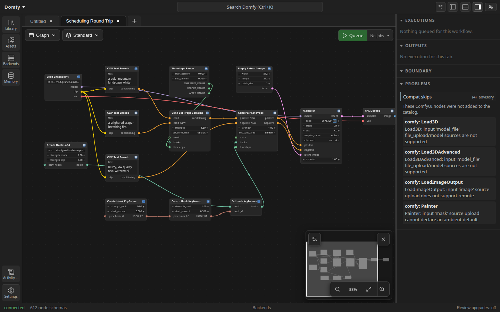
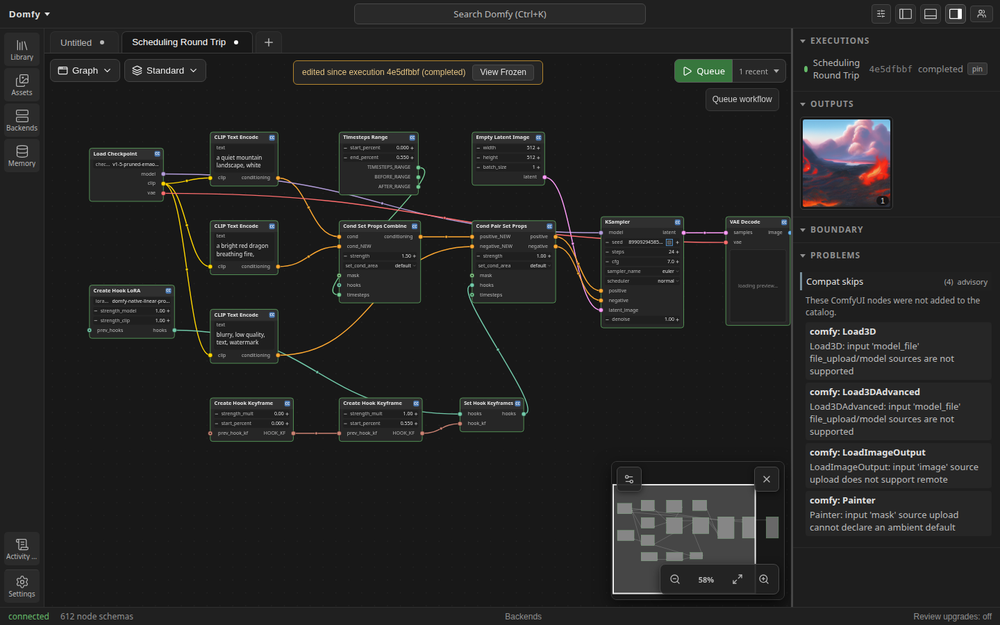
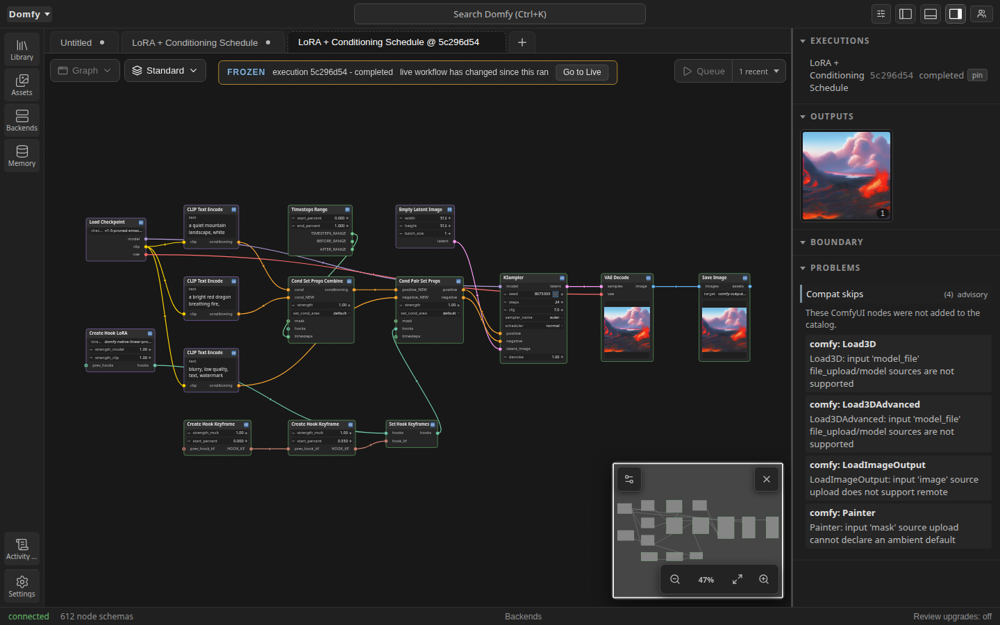

# LoRA and conditioning scheduling

Dinkster can vary LoRA strength and conditioning during native image sampling
through hook and conditioning nodes. Start with the normal **Load Checkpoint**
node; supported checkpoints remain on native execution.

## Schedule LoRA strength

1. Add Create Hook LoRA and select a LoRA asset.
2. Build the curve with Create Hook Keyframe nodes.
3. Connect the curve and hook to Set Hook Keyframes.
4. Connect the scheduled hook to Cond Set Props Combine or Cond Pair Set Props.
5. Send the resulting conditioning to KSampler.

`start_percent` is the normalized sampling position from 0 to 1.
`strength_mult` multiplies the model and CLIP strengths from Create Hook LoRA.
Add, edit, or remove keyframe nodes to change the curve. Percent values must be
unique and remain in the inclusive 0 to 1 range.

## Schedule conditioning

1. Encode the conditioning that should be active for only part of sampling.
2. Add Timesteps Range and set its start and end percentages.
3. Connect the range to Cond Set Props or Cond Set Props Combine.
4. Send the resulting conditioning to KSampler.

Use the same seed when comparing curves so that differences come from the
schedule rather than a different noise sample.

## Live example

The same seed produces visibly different outputs for the varying schedule and
the flat comparator:

Raw generated images from the same run:

The live Playwright proof uses SD 1.5 checkpoint SHA-256
`6ce0161689b3853acaa03779ec93eafe75a02f4ced659bee03f50797806fa2fa`
and a deterministic 10,616-byte linear-weight LoRA with SHA-256
`527791e0307cdfe2f63eed15ef62ef7abfdfbf9e1f23086dfc7f2fe0f1ef0d32`.
The LoRA contains one rank-4 `attn1.to_q` adapter generated with torch seed
`8675309`, normal values scaled by `0.08`, and metadata purpose
`Dinkster native scheduled LoRA end-to-end proof`.
