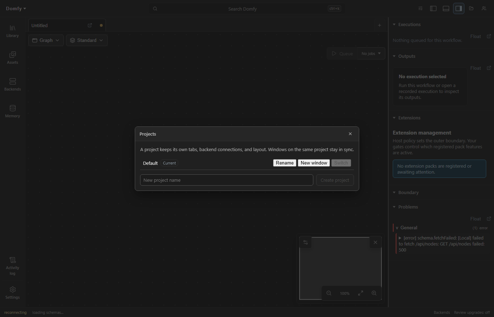
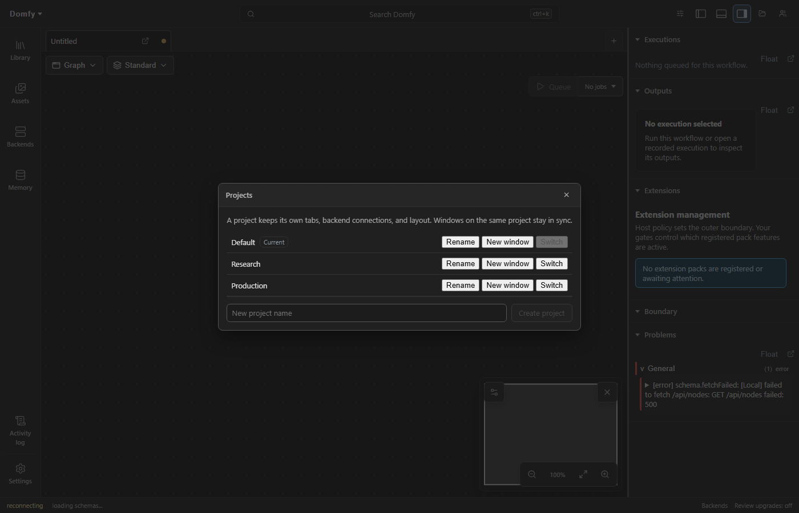
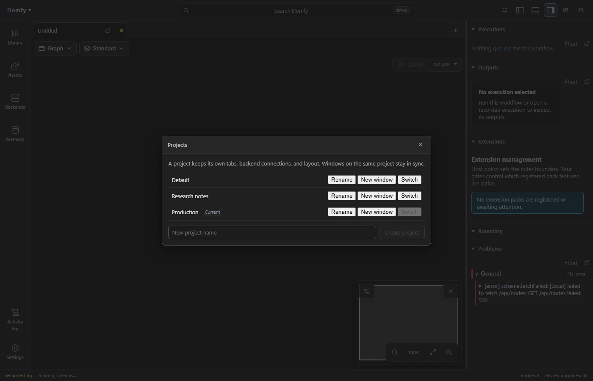

# Projects

A project is a named scope that binds together backend connections, open
documents, shell layout, and project-scoped settings. Each window belongs to
exactly one project; several windows may share one project and stay in sync,
while windows on different projects are fully isolated from each other.

## Using projects

Open **Projects** from the app toolbar (folder icon, workspace windows only)
to create, rename, or switch projects. Every installation starts with a
**Default** project that carries all pre-project state, so nothing changes
until a second project is created.

- **Create project** adds a new empty project to the registry.
- **Rename** edits a project's display name in place (Enter commits, Escape
  cancels). The default project can be renamed too.
- **Switch** rebinds the current window to the chosen project. The window
  reloads into the target scope; other windows are unaffected.
- **New window** (desktop) opens an additional workspace window bound to the
  chosen project. In the browser it opens a new tab on that project.

## What is scoped per project

Per-project state: open workflow tabs and their drafts, the write-ahead
workspace operation journal, backend connections, collaboration session
memberships, shell layout (panel placement, rail visibility, region sizes),
and the shared workflow authority. Windows sharing a project converge on one
SharedWorker tab authority; each project gets its own worker, broadcast
channels, and web locks, so cross-project state can never bleed.

Global state: the project registry itself, non-layout settings, keybindings,
and desktop engine management. The engine is a machine resource, not a
project resource.

## Identity and storage

The default project keeps the legacy unprefixed storage keys and rendezvous
names, so existing user state becomes the default project with no migration.
Other projects prefix their storage keys with `dinkster.p.<id>.` and suffix
their SharedWorker, BroadcastChannel, and Web Lock names with the project id.
A window's project is carried in its URL (`dinksterProject`); workflow pop-outs
and panel windows inherit the opener's project so they join the same tab
authority.

## Desktop windows

The desktop shell persists every workspace window with its project binding,
plus each project-associated workflow and panel window, and restores the full
arrangement at startup. Closing the primary window still quits; additional
workspace windows close independently. The same workflow may be torn out once
per project. Switching a workspace window's project reloads only that window;
tear-outs keep their own project binding and keep working.
