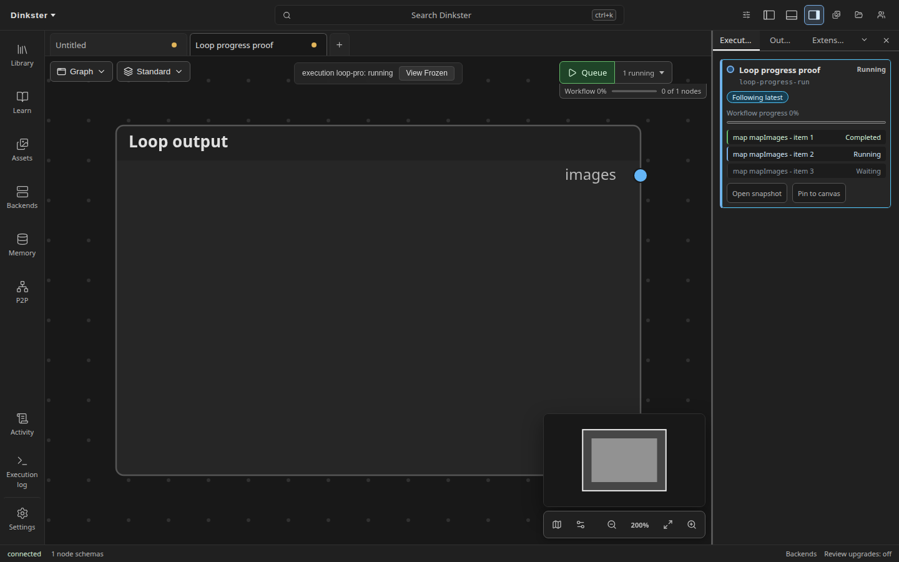
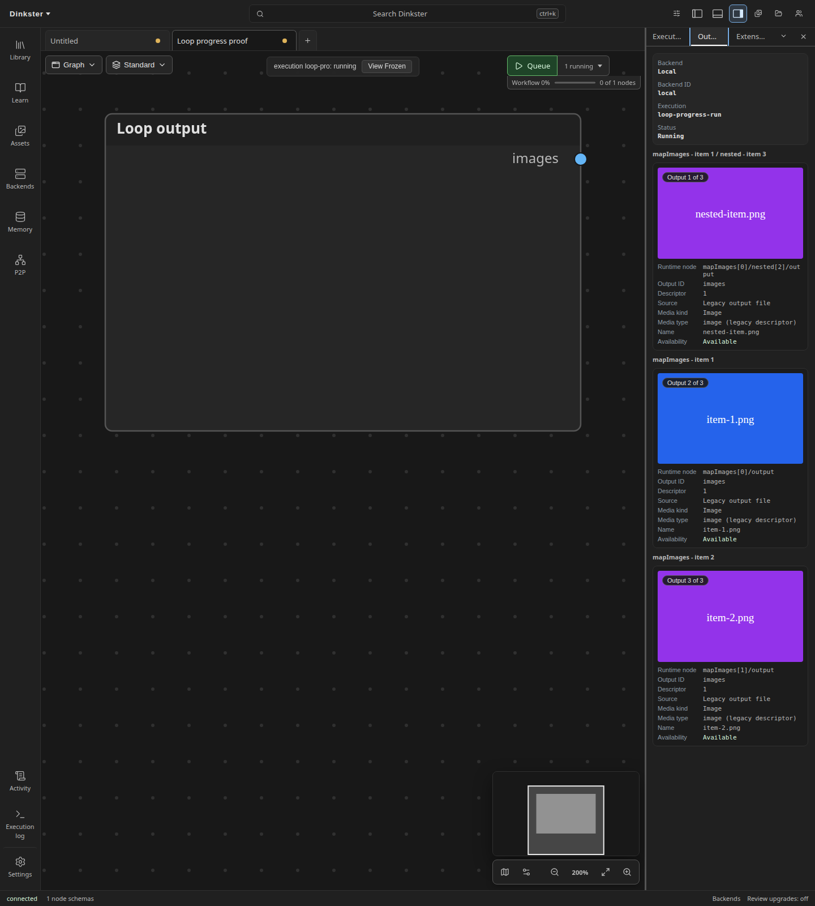

# Region authoring

Regions repeat a subgraph body with map, fold, or while semantics. The region
contract belongs to the subgraph occurrence, not to its shared definition.
Two occurrences of one definition can therefore have different roles and
configuration.

## Create a region

Use **Map region**, **Fold region**, or **While region** from the node palette,
universal search, or the empty-canvas context menu. Creation imports a fresh
definition, adds and selects one occurrence as one undoable operation. Double
click the selected occurrence to drill into its body through the ordinary
subgraph path. Frozen execution views disable these actions.

The starter body is valid immediately:

- Map has one element input and one gathered output.
- Fold has element and state inputs with a state output.
- While has a state input/output and a real boolean continuation output.

## Edit roles and configuration

Drill into a region occurrence as you would an ordinary subgraph. The Boundary
panel shows the roles for the exact occurrence used for that drill-in. The
workflow inputs and outputs remain grouped separately, and each item names its
canvas destination. **Show** focuses that destination without editing the
document.

Input roles are **Element**, **State**, and **Capture**. Output roles are
**Gather**, **Compact**, **State**, and **Flatten**; a state output names its state input.
While regions also designate a **Continuation** output. Configuration controls
set the element binding to zip, cross, or broadcast and set the maximum
iteration count.

Gather emits one output for every iteration, including absent values. Compact
emits only present outputs in deterministic iteration order. Both expose the
same outer `list<T>` type, and a compact region with no present outputs emits a
typed empty list. Body execution failures still fail the execution; compact
does not convert failures into absence.

The panel dispatches ordinary document commands. Invalid combinations are
refused without modifying the document and the refusal is shown in the panel.
For example, while regions reject cross and broadcast binding.

Ordinary subgraphs keep the existing definition-scoped Boundary panel. Region
controls appear only when the current definition was reached through an
immediate region occurrence. A missing or stale occurrence path fails closed
and hides those controls. See [Boundary editor](boundary-editor.md) for nested
slot exposure, read-only, unavailable, and diagnostic states.

## Use the iteration index

The drilled region body's Inputs node includes a derived, read-only **Index**
source. Connect it to a `core.int` input like any other canvas output. The
connection is local to that region occurrence and compiles to the immediate
map, fold, or while iteration's zero-based `$region.index`; it does not add a
workflow input or alter the shared definition boundary. Nested region bodies
therefore read their own index, not an enclosing region's index. Ordinary
subgraphs and the root graph do not show this source.

## Canvas identity

A region occurrence has a loop glyph, its map/fold/while kind in the header,
and a doubled border. Selection, execution, and diagnostic outlines retain
their existing precedence. List-typed boundary sockets retain the normal
`list<T>` socket treatment.

## Execution

Reachable region occurrences compile to native region wire entries and submit
through the normal job API when the backend advertises the `regions` graph
feature. A backend without that capability refuses with
`compile.region.backendUnsupported`. Muted regions are skipped as a whole;
bypassed regions refuse with `compile.region.bypassUnsupported` because list
contracts have no positional passthrough.

Map, fold, and while use the backend's generic value transport. They work with
images, latents, conditioning, masks, audio, video, assets, scalar values, and
pack-defined concrete types. Map occurrences can execute concurrently, but
gathered results remain in element-binding order. Fold and while occurrences
execute sequentially because each iteration receives the previous state.

The Queue card creates one row per fixed map/fold item as soon as expansion is
known. Rows move from waiting to running to completed from explicit backend
iteration lifecycle events; while rows appear as occurrences start. The
Outputs panel groups retained images under their actual runtime region item,
including nested runtime paths, instead of presenting loop results as one
unattributed workflow list.

The backend foundation pack provides editable templates named **Loop: Map
Images**, **Loop: Gather Image Batch**, **Loop: Fold and Scan Images**,
**Loop: While / Until**, and **Loop: Per-item Image Spawn**.

Inline expanded frames, wrap-selection, element-port widget editing, and
shared-definition region UI are not part of this authoring surface.
