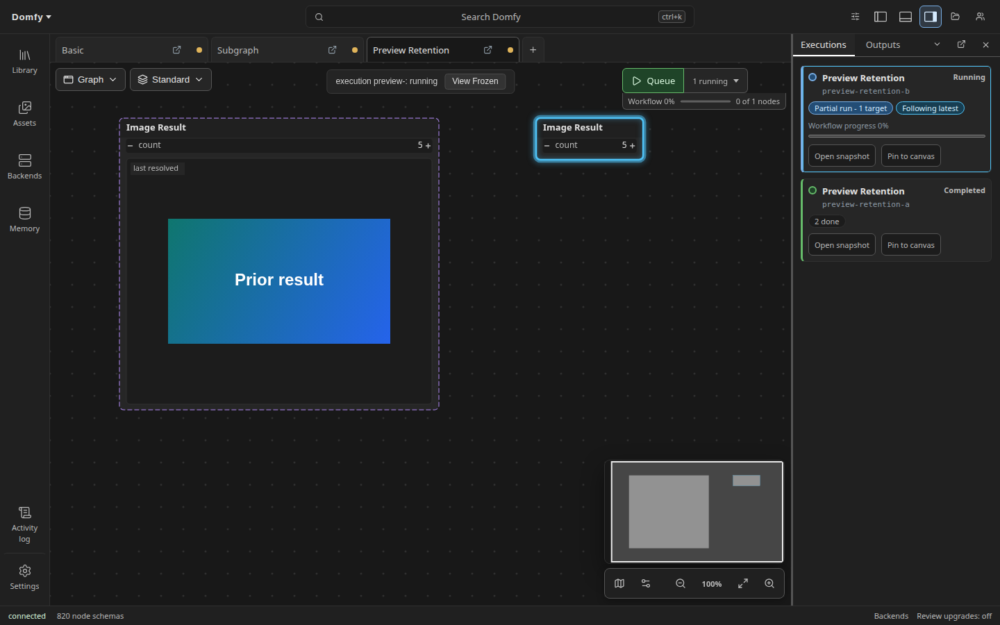

# Run history

The Library `Runs` source shows durable terminal records from the active
backend. Completed, failed, cancelled, and interrupted runs remain stored
independently; grouping changes only their presentation and never changes
submission or deletes history.

`Runs` is distinct from Library `History`. Runs pages persistent terminal
records from the active native backend and preserves its backend owner, run
and job ids, exact timestamps, source-document stamp, receipts, errors, and
pagination cursor. History is this browser's local execution-store view,
keyed by backend connection plus prompt id, and can include queued or running
work. A missing source stamp or local compile snapshot is labeled unavailable;
the UI does not infer either identity. Opening a local snapshot creates the
exact frozen execution view. Records without a snapshot remain inspectable
but cannot be opened.

The local execution-store view is bounded per backend connection: at most
200 evictable executions are kept, evicting the oldest settled runs when
new work appears, when a run settles, and when a frozen view closes. Queued
and running work, provisionally lost runs (still revivable by a live
event), and runs backing an open frozen execution view are never evicted,
so the total can exceed 200 only by the count of such protected entries.
Late events for a recently evicted run are discarded rather than
recreating it; once that bounded discard window ages out, such an event
recreates the run only as an unconfirmed entry that stays evictable and
preview-budget-bound until an observed run start or a local submission
confirms it (event timestamps are client arrival times, so age cannot tell
late chatter apart from a mid-run join). History labels a still-unconfirmed
entry `unconfirmed` instead of `queued`, since the store never observed a
queue position for it.
Terminal and unconfirmed runs keep at most 64 MiB of in-memory preview
frames beyond the newest budgeted run, whose frames are always kept even
when they alone exceed the budget. Preview stills and animation ring frames
both count toward the budget, and stripping removes both from the oldest
such runs first while everything durable (node states, digest outputs,
artifacts) stays; the budget is re-enforced whenever budgeted preview bytes
can grow, including a straggler frame arriving after a run's terminal
verdict. Confirmed in-flight runs are never stripped. Durable `Runs` records
on the backend are unaffected.

Run rows name the authenticated principal that queued them when the backend
provides one. Agent submissions also carry a compact `agent` badge. The local
human principal stays hidden to avoid adding noise to single-user runs, and
older backends that omit attribution render exactly as before.

Every activity row names its state in text as well as using status styling.
Full workflow, backend, prompt, run, job, and source identities wrap instead
of being shortened. Partial runs, node progress, errors, and incomplete
provenance remain visible. The right-rail Executions section groups the active
workflow's local executions by backend, retaining a warning group when an
owner was removed or disconnected. Its Pin and Follow latest actions only
change the existing live-tab overlay binding.

## Interrupted runs

When the backend restarts, jobs that were queued or running when the process
died surface as durable records with state `interrupted`. Nothing resumes
automatically: an interrupted job runs again only when a person explicitly
resubmits it. Each interrupted row states its sweep phase - `never started`
for a job the server accepted but never began, `was running` for one that
died mid-execution - and carries the backend's error message explaining that
the job was not re-run.

Stamped interrupted records offer a `Resubmit` action. Resubmit reopens the
exact producing workflow document from its `sourceDocument` digest (drift
diagnostics included) and queues it through the normal compile and submit
pipeline. This is a fresh submission with a new job identity, never a resume:
compile problems refuse the queue exactly as a manual Run click would, and
the opened tab stays for inspection. Unstamped interrupted records have no
recorded source document, so they show `Source unavailable` and cannot be
resubmitted from history.

The state filter in the Runs search box accepts `interrupted` alongside the
other terminal states.

## Execution arms

Execution-arm policy is implementation metadata and does not appear as a tab
on ordinary node cards. The backend chooses the exact arm immediately before
its cache lookup, when runtime values are available. A `Cached` disposition
means the selected arm's cache identity supplied the result; the node did not
execute again.

Durable run rows summarize Native and ComfyUI receipt counts. Their details
list each runtime node's disposition, selected arm, provider, and pack when
reported, so completed and failed runs retain the same evidence after the live
canvas state is gone. Records from older backends remain readable and simply
omit absent facts.

## Execution machines

When the native backend reports worker attribution, durable run rows summarize
receipt counts by machine. Per-node details place the worker name beside the
disposition and selected arm. Local History also lists each observed node's
state, arm, and worker. Progress updates and terminal transitions retain the
first known location, so a later update that omits location metadata does not
erase it. Older records remain readable and simply omit worker facts.

## All-cached run groups

A terminal completed run is an all-cached no-op when `executed == 0` and
`cached > 0`. Within each loaded durable page, consecutive no-op runs with
the same `sourceDocument` digest collapse into one row. The row shows the
latest occurrence and an explicit run count.
`Show runs` expands every stored member in newest-first history order, where
each member retains its own details and actions.

Delete record and Clear all require a visible confirmation activation before
their existing atomic backend commands run. Deleting still removes only the
selected history record; clearing still applies to the displayed backend-owned
page scope. Open workflow remains a separate explicit action.

`sourceDocument` is the strongest stable document identity retained in durable
history: it is the content digest of the exact submitted workflow revision.
Durable records do not retain the submitted target set, so this grouping does
not claim to be execution identity. Unstamped runs have no safe document
identity and remain individual. A run for another digest, an
executed completion, failure, or cancellation breaks a group. Live running
jobs are shown by the separate `History` source and never enter a durable
group before terminal completion.

The backend currently publishes terminal execution state before its durable
history write is causally acknowledged. An already-open Runs panel can need
its next ordinary refresh before that new record appears. A future backend
post-commit event or write-before-terminal guarantee will close this gap;
the frontend deliberately does not guess with a fixed delay.

Dinkster still submits every Run click. The frontend does not infer backend cache
state before submission, because graph and cache state can change between
clicks. The backend also does not need an `allCached` convenience field; the
durable counts are the authoritative classification.

## Live run retention

A live run can leave nodes without fresh results: a partial run never
executes nodes outside its targets, and a whole run reports each node only
as it reaches it. Dinkster keeps a node's last resolved widget values only when
an older completed run used the same backend connection and lineage and the
existing compiled-recipe comparison proves that node's full upstream
computation is unchanged. These values are labeled `Retained last-resolved`,
never current. Changed schemas, graph dependencies, controller-sensitive
computation, missing provenance, or any proof uncertainty discard the
candidate.

Retention applies from the moment the run is queued, through running, and in
every terminal state, so proven prior results never blank out while a run is
in flight. Only completed older runs are ever candidates, and the current
run always wins: a node explicitly requested by a partial run stays blank
until it reports, and any node the current run reports (running, cached,
done) immediately replaces its retained display.

This cross-run provenance is tracked separately from a backend cache hit.
Backend-cached values remain current in pinned views and still require the
ordinary live recipe proof after edits; they are never called retained merely
because the backend reported a cache hit.

Preview retention carries two shapes between runs: immutable digest-addressed
assets, and runtime preview frames whose bytes are already held in memory.
Temporary or filename-addressed outputs are never carried between runs
because a backend may recycle those names, but an in-memory frame always
shows exactly the bytes received for its occurrence, so a node whose only
visual is a preview frame keeps its display. A retained preview is labeled
`last resolved`. Current-run values and previews always take priority, and
opening a pinned historical execution remains an exact view of that run.
