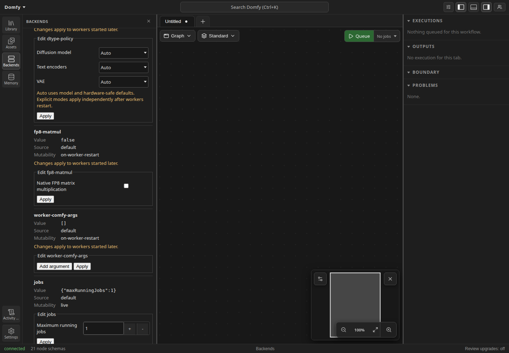

# Backend connections and runtime settings

Open **Backends** to discover a server by URL and add it as an isolated
connection, schema registry, and scoped client. Duplicate addresses and
incompatible servers are refused. Each backend card reports the
server-authoritative connection, schema, engine, and composition state. Failed
schema requests can be retried, failed or stopped supervised engines can be
restarted, and non-default backends can be removed. The default backend cannot
be removed. Unexpected connection loss remains visible while automatic
reconnection proceeds.

Backend connection headings, statuses, notices, progress wrappers, form copy,
and actions follow the active application locale without reconnecting or
resetting an in-flight action. Backend labels and URLs, schema errors,
supervisor details, composition phases, protocol identifiers, process IDs, and
progress values remain server or runtime facts and are displayed verbatim.

Native Dinkster backends expose their effective memory and process controls in
the same card. Expand **Runtime settings** under a native backend. Settings
belong to that server; each backend has an independent section. The section
fetches when opened and can be updated with **Refresh**. It does not poll, and
a refresh leaves previously loaded values visible if the new request fails.

Native backend cards also provide **Saved image location**. Choose any
read-write library mount to change where Save Image writes when its target is
not set. Applying the selection persists it in the backend's `mounts.toml`.
Execution output details show the mounted path immediately after a save. The
Desktop app can reveal that path in the operating system's file browser.

Every category displays its effective JSON value, source, and server-reported
mutability. `on-worker-restart` means an edit applies to workers started after
the change, not workers that are already running. Categories unknown to this
frontend remain visible as read-only JSON, so additive backend categories do
not break the panel.

The server response controls editing. A known category gets an editor only
when the category is in `categories.granted` and its section is `writable`.
When the granted list is empty, the panel contains no mutation controls. This
is presentation behavior only; the backend remains the security boundary.

Native backend cards also show permission gates for non-human principals.
The panel heading and known permission category labels follow the active
application locale without refetching principals or resetting an in-flight
permission update. Backend names, principal identifiers and kinds, unknown
category identifiers, and server error messages remain server-owned data and
are displayed verbatim.

The current editors cover memory budgets, memory headroom, Aimdo policy,
component dtype policy, native FP8 matrix multiplication, embedded worker
ComfyUI arguments, maximum running jobs, and logging levels/overrides. The
dtype policy controls diffusion models, text encoders, and VAEs independently;
each component supports Auto, FP16, BF16, and FP32. Auto uses the backend's
model- and hardware-safe default.

Known editors use the shared product field, notice, and action-footer
language. Labels remain associated with their controls, repeated argument and
logger rows keep their Remove action beside the owned field, and Apply remains
the only persistence boundary. Reset restores the server-reported value.
Category summaries distinguish editable, read-only, grant-required, and
unsupported-editor states. Narrow panels stack controls without introducing
horizontal page overflow.

Memory sizes accept bytes or K/M/G/T strings and are sent in the form entered.
Worker arguments are an ordered list with one argument per row. Empty-after-trim
rows are omitted, while every non-empty argument is sent verbatim so spaces can
remain part of one argv token. Remove every row, or leave every row empty, and
apply the change to send `[]` and clear the list.

Validation and permission errors remain inline beside the category until the
next edit or successful retry. A worker argument rejected as server-owned also
displays `Rejected flag: <flag> (owned by <owner>).` on a separate line. After
a successful edit, the returned section replaces the displayed section. If
the server could not persist it, an in-memory-only note remains visible.

Universal search includes the **Open Backends** command as a low-cost route to
the panel. Backend runtime categories are intentionally not indexed as local
application settings because they are discovered per server.

Packs may declare application settings in their manifests. Packs with declared
settings appear by display name in the application **Settings** dialog. The
backend supplies each field's label, description, type, constraints, and
effective value; edits are validated and stored by that backend. These pack
settings are separate from the per-backend runtime controls described above.

The wire contract is jointly owned with `Dinkster/docs/settings-api.md`.
